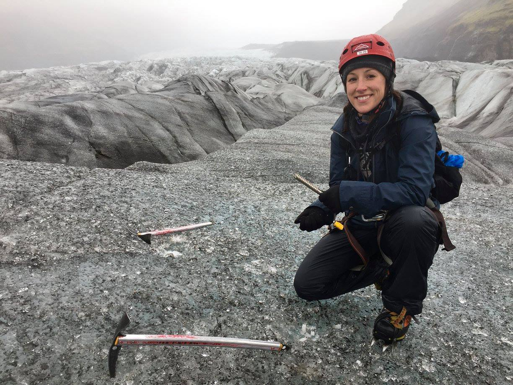

# About me 
I'm Jessie Lehosky (She/her/hers) and I'm  a Heinz College MPM Student graduating in December 2020. I currently work as an Associate Director of Alumni Relations at the Tepper School of Business at CMU. I've previously had the privilege to work for the National Aviary and The Western Pennsylvania Conservancy, and hope to use my degree and experience at CMU to further support organizations promoting the importance of environmental educations and resource preservation.  

I currently serve on the Junior Board of Venture Outdoors, a Pittsburgh non-profit dedicated to introducing people to outdoor recreation opportunities. In my free time, I enjoy mountain biking, rock climbing, and trail running, and am currently nurturing a newfound love of videography and video editing. 

# What I hope to learn
I hope to learn of creative ways to take the piles of data non-profits collect, but often don't have the time or resources to process, and be able to turn them into captivating and engaging visual tools that organizations can use to move people to action and support. With a background (and future) in non-profit volunteer and community engagement, inspiring potential supporters to take those first steps of involvement with an organization is key! 

# Portfolio

<iframe title="Brazil's..." aria-label="chart" id="datawrapper-chart-ae3tn" src="https://datawrapper.dwcdn.net/ae3tn/1/" scrolling="no" frameborder="0" style="width: 0; min-width: 100% !important; border: none;" height="460"></iframe>
